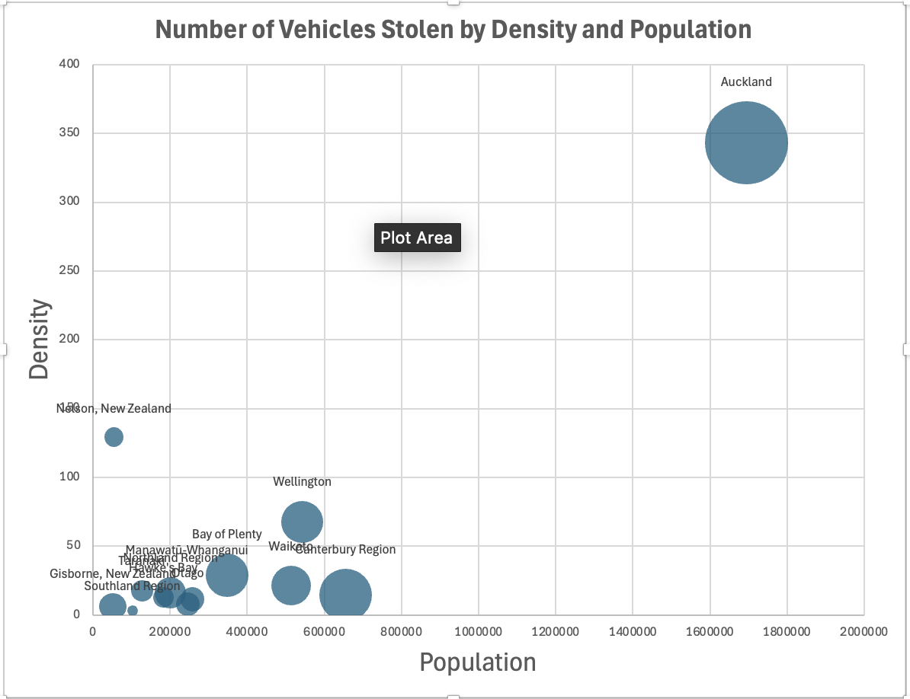
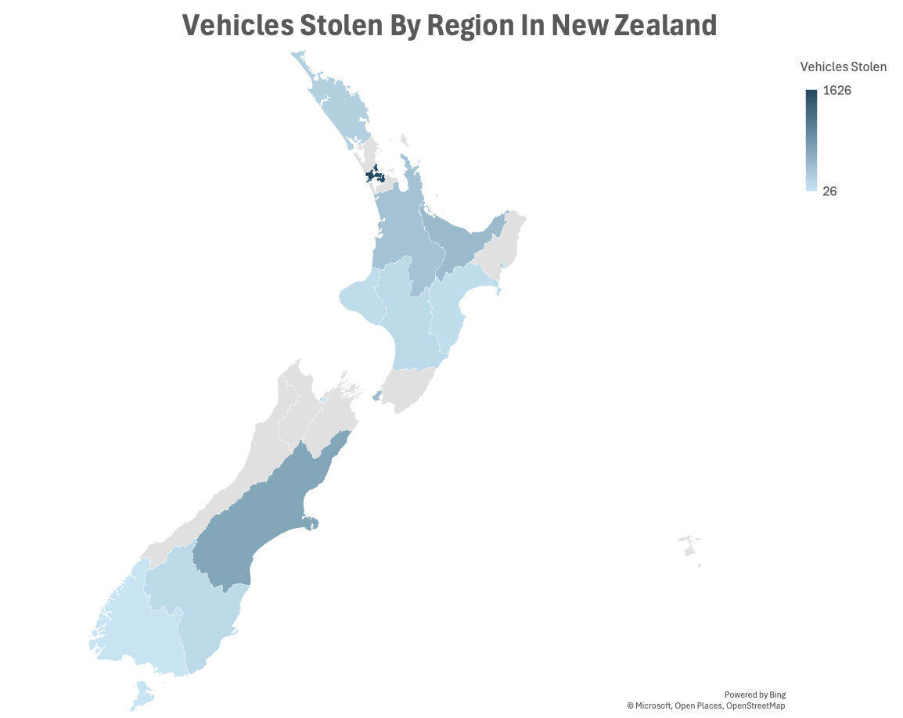
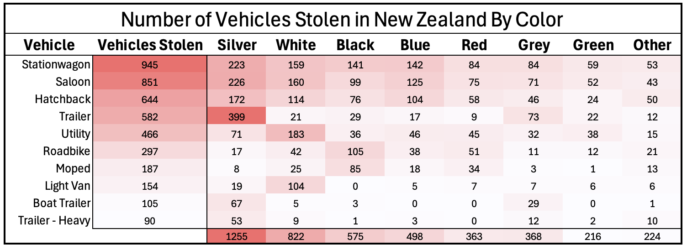
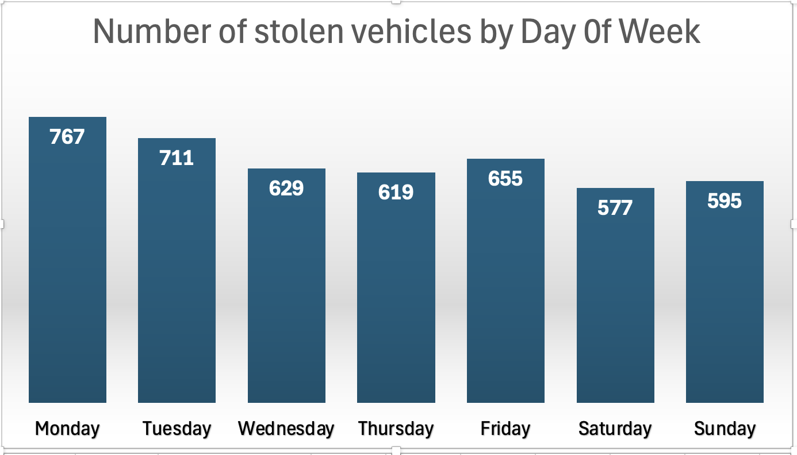

# Motor Vehicle Thefts Analysis in New Zealand

## Project Overview

This report presents an analysis of motor vehicle thefts in New Zealand, focusing on identifying patterns related to when, where, and which vehicles are most frequently stolen. The goal of this analysis is to support law enforcement and public awareness efforts by providing data-driven insights.

### Objectives:

1. Identify when vehicles are most likely to be stolen.
2. Identify which vehicles are most frequently stolen.
3. Identify where vehicle thefts are most common.

### Data Visualizations

Below are key visualizations that illustrate the findings from this analysis:

#### Vehicle Theft Trends by Population and Density



#### Theft Distribution Across Regions



#### Vehicle Thefts by Color and Type



#### Theft Frequency by Day of the Week



## Tools Used

- **SQL**: Data extraction, transformation, and analysis
- **Excel**: Data visualization and formatting

---

## Exploratory Data Analysis (EDA)

### Vehicle Types in the Dataset

```sql
SELECT 
    vehicle_type, 
    COUNT(*) 
FROM 
    stolen_vehicles
GROUP BY 
    vehicle_type;
```

### Date Range of the Dataset

```sql
(SELECT 
    'Start Date' AS ' ', 
    MIN(date_stolen) AS 'Date'
FROM 
    stolen_vehicles)
UNION
(SELECT 
    'End Date', 
    MAX(date_stolen) AS 'Date'
FROM 
    stolen_vehicles)
UNION
(SELECT 
    'Number of Days', 
    DATEDIFF(MAX(date_stolen), 
    MIN(date_stolen))
FROM 
    stolen_vehicles);
```

### Count of Vehicles Stolen by Model Year

```sql
SELECT 
    model_year, 
    COUNT(*) 
FROM 
    stolen_vehicles
GROUP BY 
    model_year
ORDER BY 
    model_year DESC;
```

### Count of Vehicles Stolen by Location and Region

```sql
SELECT 
    sv.location_id, 
    region, 
    COUNT(*)
FROM 
    stolen_vehicles sv
LEFT JOIN 
    locations l
ON 
    sv.location_id = l.location_id
GROUP BY 
    sv.location_ID, region
ORDER BY 
    COUNT(*) DESC;
```

---

## When Are Vehicles Stolen?

### Number of Vehicles Stolen Each Year

```sql
SELECT 
    YEAR(date_stolen) AS 'Year Stolen', 
    COUNT(*) AS 'Number of stolen vehicles'
FROM 
    stolen_vehicles
GROUP BY 
    YEAR(date_stolen);
```

### Number of Vehicles Stolen Each Month

```sql
SELECT 
    YEAR(date_stolen) AS 'Year Stolen', 
    MONTH(date_stolen) AS 'Month Stolen', 
    COUNT(*) AS 'Number of stolen vehicles'
FROM 
    stolen_vehicles
GROUP BY 
    YEAR(date_stolen), 
    MONTH(date_stolen)
ORDER BY 
    YEAR(date_stolen);
```

### Number of Vehicles Stolen Each Day of the Week

```sql
SELECT 
    DAYOFWEEK(date_stolen) AS 'Day of Week', 
    COUNT(*) AS 'Number of stolen vehicles'
FROM 
    stolen_vehicles
GROUP BY 
    DAYOFWEEK(date_stolen)
ORDER BY 
    DAYOFWEEK(date_stolen);
```

---

## Which Vehicles Are Stolen?

### Most and Least Frequently Stolen Vehicle Types

```sql
(SELECT 
    vehicle_type, 
    COUNT(*)
FROM 
    stolen_vehicles
GROUP BY 
    vehicle_type
ORDER BY 
    COUNT(*) DESC
LIMIT 5)
UNION
(SELECT 
    vehicle_type, 
    COUNT(*)
FROM 
    stolen_vehicles
GROUP BY 
    vehicle_type
ORDER BY 
    COUNT(*)
LIMIT 2);
```

### Average Age of Stolen Vehicles by Type

```sql
SELECT 
    vehicle_type, 
    AVG(YEAR(date_stolen) - model_year) AS Average_Age
FROM 
    stolen_vehicles
GROUP BY 
    vehicle_type
ORDER BY 
    Average_Age DESC;
```

### Percentage of Stolen Vehicles That Are Luxury

```sql
WITH lux_standard AS
    (SELECT 
        vehicle_type, 
        CASE 
            WHEN make_type = 'Luxury' THEN 1 ELSE 0 
        END AS luxury, 
        1 AS all_cars
    FROM 
        stolen_vehicles sv
    LEFT JOIN 
        make_details md 
    ON sv.make_id = md.make_id)

SELECT 
    vehicle_type, 
    SUM(luxury)/ SUM(all_cars) * 100 AS percent_luxury
FROM 
    lux_standard
GROUP BY 
    vehicle_type
ORDER BY 
    percent_luxury DESC;
```

---

## Where Are Vehicles Stolen?

### Number of Vehicles Stolen in Each Region

```sql
SELECT 
    region, 
    COUNT(vehicle_type) AS num_vehicles
FROM 
    stolen_vehicles sv
LEFT JOIN 
    locations l 
ON sv.location_id = l.location_id
GROUP BY 
    region;
```

### Theft Count with Population and Density Statistics

```sql
SELECT 
    region, 
    population, 
    density, 
    COUNT(vehicle_type) AS num_vehicles
FROM 
    stolen_vehicles sv
LEFT JOIN 
    locations l 
ON sv.location_id = l.location_id
GROUP BY 
    region, 
    population, 
    density;
```

### Comparison of Vehicle Thefts in High-Density and Low-Density Regions

```sql
(SELECT 
    'High Density' AS Density_Category, vehicle_type, 
    COUNT(vehicle_id) AS num_vehicles
FROM 
    stolen_vehicles sv
LEFT JOIN 
    locations l 
ON sv.location_id = l.location_id
WHERE 
    region IN ('Auckland', 'Nelson', 'Wellington')
GROUP BY 
    vehicle_type
ORDER BY 
    num_vehicles DESC
LIMIT 5)
UNION
(SELECT 
    'Low Density', vehicle_type, 
    COUNT(vehicle_id) AS num_vehicles
FROM 
    stolen_vehicles sv
LEFT JOIN 
    locations l 
ON sv.location_id = l.location_id
WHERE 
    region IN ('Otago', 'Gisborne', 'Southland')
GROUP BY 
    vehicle_type
ORDER BY 
    num_vehicles DESC
LIMIT 5);
```

---

## Key Findings

- Vehicle thefts are most prevalent in high-density regions, particularly Auckland.
- The highest number of thefts occur on Mondays, with the lowest occurring on Saturdays.
- Silver is the most frequently stolen vehicle color, followed by white and black.
- Station wagons, saloons, and hatchbacks are the most stolen vehicle types.
- Luxury vehicles account for a small proportion of total thefts.
